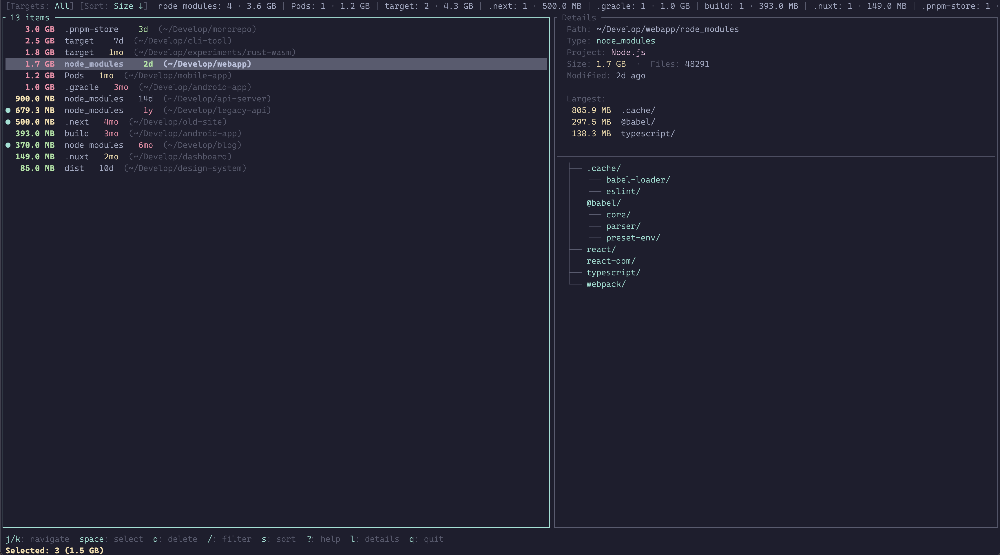

# lazyprune

A TUI tool to find and delete heavy cache/dependency directories (`node_modules`, `Pods`, `.gradle`, `target/`, etc.) across your machine.

Scans from `$HOME` by default, shows results in real-time, and lets you interactively select what to delete with vim-style keybindings.



## Install

```bash
cargo install lazyprune
```

Or build from source:

```bash
git clone https://github.com/ThibaultJRD/lazyprune.git
cd lazyprune
cargo install --path .
```

## Usage

```bash
lazyprune                        # Scan from $HOME
lazyprune ~/Develop              # Scan a specific directory
lazyprune --target node_modules  # Only look for node_modules
lazyprune --dry-run              # Print results to stdout, no TUI
lazyprune --init-config          # Generate config at ~/.config/lazyprune/config.toml
```

## Keybindings

| Key | Action |
|-----|--------|
| `j/k` `↑/↓` | Navigate |
| `g/G` | Jump top/bottom |
| `Space` | Toggle selection |
| `v` | Invert selection |
| `Ctrl+a` | Select all |
| `d` | Delete selected |
| `/` | Filter by path |
| `s` | Cycle sort (size, name, date, project) |
| `t` | Filter by type |
| `l/→/Enter` | Open details panel |
| `h/←/Esc` | Back to list |
| `y` | Copy path (in details) |
| `?` | Help |
| `q` | Quit |

## Config

Default targets are built-in. Override with `~/.config/lazyprune/config.toml`:

```toml
root = "~"
skip = [".Trash", "Library"]

[[targets]]
name = "node_modules"
dirs = ["node_modules"]
indicator = "package.json"

[[targets]]
name = "Pods"
dirs = ["Pods"]
indicator = "Podfile"
```

Each target has:
- `dirs` -- directory names to look for
- `indicator` (optional) -- a file that must exist in the parent to confirm it's a real target (avoids false positives, e.g. a random `build/` folder that isn't Gradle)

Default targets: `node_modules`, `Pods`, `.gradle`/`build`, `.pnpm-store`, `.yarn/cache`, `.next`, `.nuxt`, `target` (Rust), `dist`.

## How it works

- Walks the filesystem using the [ignore](https://crates.io/crates/ignore) crate (from ripgrep)
- Computes directory sizes in parallel with [rayon](https://crates.io/crates/rayon)
- Skips hidden directories unless they match a target
- Never follows symlinks
- Deletion requires explicit confirmation

## License

MIT
